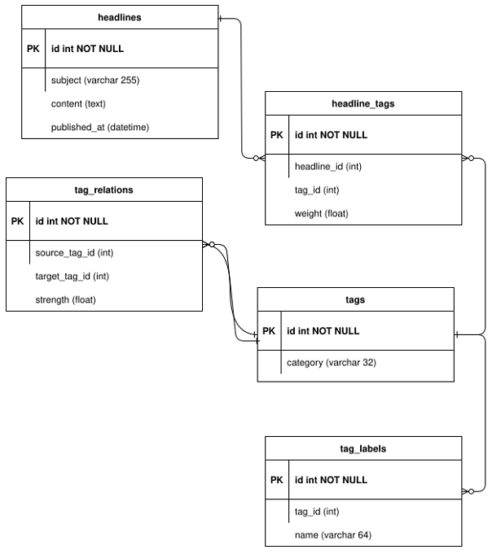

# Solr PoC

Simple Proof of Concept search engine built with Apache Solr.

## Use Case / Problem Description
Imagine the following schema:

1. Headlines have text content in subject/content text fields, which are associated with tags via the headline_tags table.
2. Tags have many labels (e.g. UK, United Kingdom, Great Britain, GB) and are categorised (e.g. geographical, in this instance). Tags can be related to each other in a tree/DAG structure. e.g. UK will be related to Europe where the tag ID for UK will be used in the source_tag_id and the tag id for Europe will be populated in target_tag_id in this instance.
3. The strength field indicates how strong the relationship is between the tags and is an arbitrary floating point number between 0 and 1. Likewise, the strength of the relationship between tags and headlines will be set in the headline tags weight field in a similar manner. Various criteria can be used to set this (e.g. the number of times the tag label appears in the headline, some tags might be set to be more important, such as tags categories as companies).
4. Assuming there are tags for the following, their aliases (in brackets) and their associated tag relations [in square brackets]. 
   1. UK (United Kingdom) [Europe]
   2. Bank of England (BoE) [UK, Central Banks]
   3. Central Banks [Fixed Income]
   4. Europe 
   5. Fixed Income 
   6. Oil (Crude, WTI) [Commodities]
   7. Commodities
5. A headline with the subject “BoE cuts interest rates by 0.5%” should be searchable by its aliases such as Bank of England, along with any related tags and their aliases, both directly related, such as UK, Central Banks and United Kingdom. Likewise, indirect relations, such as Fixed Income and Europe should also need to return this headline. Obviously, a search for Oil/WTI/Crude/Commodities tags should not yield results for this headline.

## The end goal
> We need to model this use-case of searching using Apache Solr and not any SQL database. How can we, at a high level, leverage Solr’s search indexing such that the above tagging mechanism can be accounted for.

## Abstract Solution
1. We need to create a collection/core in Solr.
2. We need to de-normalize the whole data in our database (which we want to search on) and send it to Solr for indexing. You can see it in [solar_index.py](./solr_index.py) file. Of course, in a production environment, we need to use something like Solr's **Data Import Handler** which can ingest data from postgres directly.
3. We don't need to create "weight" fields in Solr since Solr automatically scores the queries and rank the search results accordingly. 
4. If default scoring mechanism is not good enough for us then we can:
   1. Boost important/relevant terms. We can even leverage functions here.
   2. Implement a custom similarity algorithm based on the nature of our problem.
5. when the data is indexed we can simply query it using the `OR` option for all the required fields. You can see it in [solar_query.py](./solr_query.py) file. You can create query of any complexity you like.
6. We can also apply facets to tag categories to narrow down the search results.

## How to Run this PoC?

Must have Docker Desktop installed in your PC.

1. Clone the code.
2. Create a copy of `.env.example` file in the code's root folder.
3. Rename the copy file to `.env`.
4. Change the value `SOLR_COLLECTION_NAME` in the `.env` file to whatever you want.
5. Run `docker-compose up`
6. Now you can query Solr using `http://localhost:8000/search` endpoint. Give it a query param `q` with your search term and it will respond with some results. You can see/change the pre-populated SQL data in `init.sql` file.
7. You can go to Solr Admin at `http://localhost:8983/solr`
